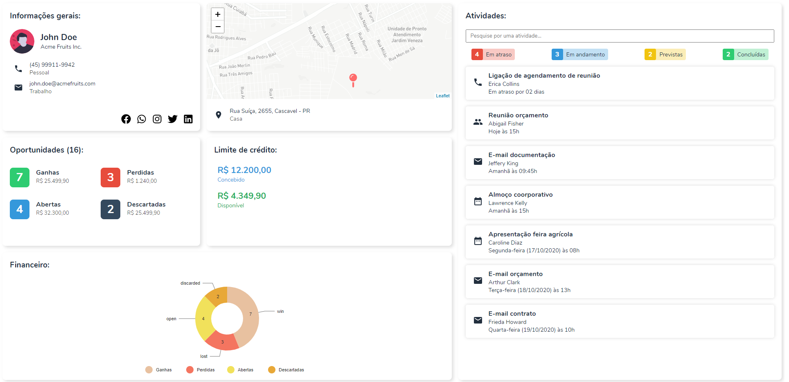

# :rocket: Projeto para Desenvolvedor Front-end - WS

## Informações sobre o projeto:

Esta é a realização de um desafio técnico proposto pela WS/TOTVS CRM para a vaga de Desenvolvedor Front-end, onde foi necessário construir uma tela para um resumo de cliente, conforme apresentado no [repositório do desafio](https://github.com/WealthSystems/frontend-challenge).

Nele contém uma tela principal somente, com o resumo do cliente, e alguns cards que trazem informações financeiras, de atividades, créditos, localização e oportunidades.

### Tela principal:



Estas informações são trazidas por uma requisição realizada ao arquivo [`db.json`](./public/db.json). <br/> 
O design da tela é **responsivo**, com 3 breakpoints (Full 🖥️, HD 💻 e Mobile 📱).

## Funcionalidades:

> Observação: em alguns casos, pode haver uma melhoria ou algo que eu poderia ter feito, porém, não os fiz por falta de tempo. Irei citar estas melhorias no decorrer, para entendimento do que eu havia idealizado fazer.

- **Mapa**: consiste de um mapa que, no código, está setado as coordenadas para um marcador onde poderia ser a localização do cliente, que viria do back-end. O centro do mapa é onde o usuário que está acessando a aplicação está, através do `navigator.geolocation.getCurrentPosition()`. <br/> 
Este comportamento pode ser melhorado, utilizando o centro do mapa com o marcador da localização do cliente, e ao usuário aceitar o acesso à localização atual, traria um segundo marcador, tirando o zoom e mostrando a distância entre ambos.

- **Gráfico**: como dito que gostavam de mapa e indicadores, estas foram as duas primeiras coisas que foquei! <br/> 
O gráfico de pizza, inserido na aplicação, traz os dados das Oportunidades. Poderia ter sido implementado outros, com a mesma biblioteca [@nivo](https://nivo.rocks/).

- **Atividades**: pode ser realizado pesquisas com o `input` inserido no componente de Atividades. Essa pesquisa leva em consideração o 'título' da atividade (primeira frase que aparece em cada atividade). Foi feito uma função que é executada ao digitar algo neste `input`, onde é utilizado o metódo `filter()` para a geração de um novo Array com as atividades que dão match na string do `input`. Se houvesse uma API, poderia também registrar novas atividades.
<br /><br />

O restante da aplicação consistiu bastante na melhoria do código fonte, na componentização e reutilização de funções e da estilização com o CSS.

Não foi realizado testes por questões de tempo também, pois, atualmente, como QA, eu já realizo testes E2E e API utilizando o TestCafé/Cypress.io e Postman API respectivamente.

## Como executar a aplicação:

Este projeto foi feito com base no React.js, sendo assim, será necessário:
1) clonar este repositório e acessar a pasta onde clonou;
```
git clone https://github.com/silipi/desafio-dev-front-ws.git
```
2) instalar as dependências de projeto;
```
npm install
```
3) e, executar a aplicação como desenvolvimento;
```
npm run start
```

## Tecnologias utilizadas:

- [React.js](https://pt-br.reactjs.org/) (componentização e base).
- [Leaflet](https://react-leaflet.js.org/) (mapa).
- [Nivo](https://nivo.rocks/) (gráficos/charts).
- [Axios](https://github.com/axios/axios) (requisições HTTP).
- CSS puro, sem Bootstrap ou outro framework.
- Javascript ES6.

## Agradecimentos:

Gostaria de agradecer pela oportunidade de realizar este desafio e de me aceitarem nesta primeira etapa! ☺️ <br/>
Desenvolvimento sempre foi meu sonho, atualmente estou até cursando graduação nesta area pois pretendo seguir esta carreira. 🎓 

Espero que tenham gostado da forma como apresentei o conteúdo, ainda sou um iniciante, mas um iniciante que gosta bastante de aprender e desenvolver! <br/>
Meu site, com alguns outros projetos (aliás, ainda tem este meu GitHub, cheio de projetinhos): [https://silipi.netlify.app/](https://silipi.netlify.app/)
